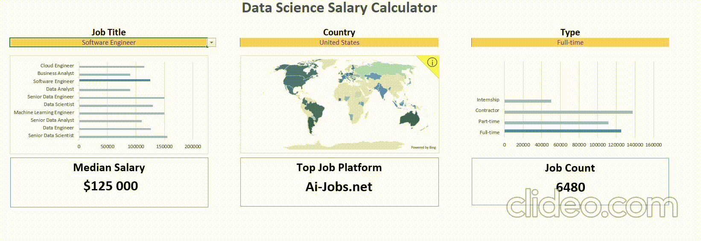

# Salary Dashboard in Excel

## 📖 Introduction

The **Salary Dashboard** is an interactive Excel-based tool designed to analyze and compare salaries in the field of Data Science.  
It provides a calculator where you can explore salary levels depending on multiple factors such as **job title**, **country** and **employment type**.

The project combines raw job posting data with aggregated statistics, making it useful both for **career research** and **market analysis**.  
It highlights salary differences across roles (Data Scientist, Data Engineer, Machine Learning Engineer, Analyst, etc.), employment formats (full-time, part-time, contractor, internship), and geographic regions.  

In addition to salary calculations, the dashboard also includes **KPI metrics** (e.g., median salary, number of postings, platform with the best CR of hires, median salary ranges) that provide quick insights into the job market.  

This dashboard can serve as a quick reference for professionals exploring job opportunities, HR specialists analyzing compensation trends, or anyone interested in the **global Data Science job market**.
